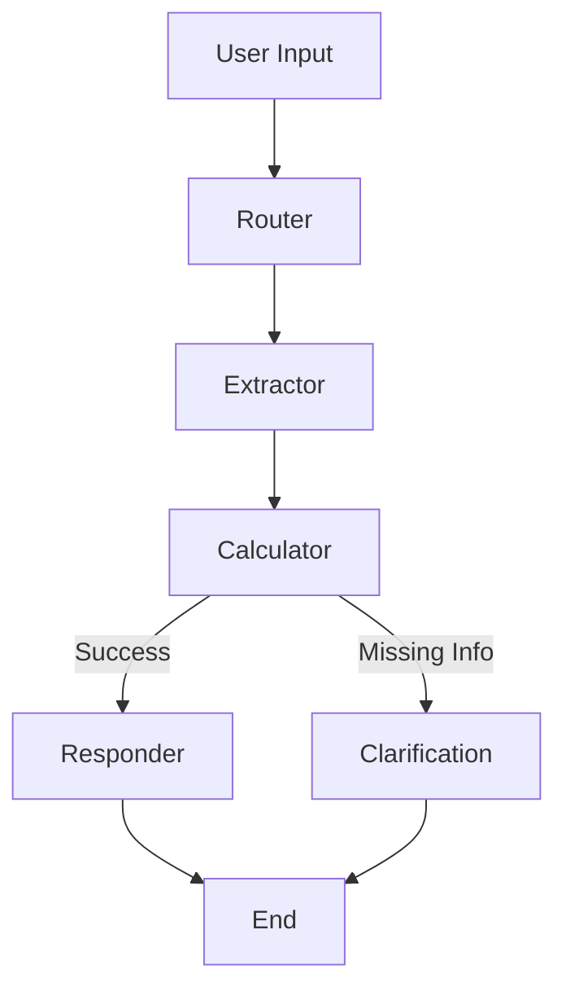

# Real Estate AI Agent (LangGraph)

A multi-agent system for real estate asset management using LangGraph, LangChain, and Streamlit.

## 🚀 Overview

This agent acts as a virtual real estate asset manager assistant. It processes natural language queries to:
- Compare property prices and P&L.
- Calculate portfolio performance.
- Retrieve asset details.
- Analyze expenses.

It uses **LangGraph** to orchestrate a workflow of specialized agents (Router, Extractor, Calculator).

## 🛠️ Tech Stack

- **Python 3.10+**
- **LangGraph & LangChain**: For multi-agent orchestration.
- **OpenAI GPT-4o-mini**: Understanding and intent classification.
- **Streamlit**: Chat interface.
- **Pandas**: Data processing (parquet/csv).

## ⚡ Setup & Run

1. **Clone the repository:**
   ```bash
   git clone <repo-url>
   cd yossi_mat
   ```

2. **Create a virtual environment:**
   ```bash
   python -m venv .venv
   .\.venv\Scripts\activate  # Windows
   # source .venv/bin/activate  # Mac/Linux
   ```

3. **Install dependencies:**
   ```bash
   pip install -r requirements.txt
   ```

4. **Configure environment:**
   Create a `.env` file:
   ```env
   OPENAI_API_KEY=sk-your-key...
   OPENAI_MODEL=gpt-4o-mini
   ```

5. **Run the app:**
   ```bash
   streamlit run app.py
   ```

## 🏗️ Architecture

The system follows a graph-based architecture using **LangGraph**:

1. **Router Agent**: Classifies the user's intent (e.g., `compare_properties`, `property_summary`).
2. **Extractor Agent**: Extracts structured entities (property names, dates, tenants) from the query.
3. **Calculation Node**:
   - Validates entities (checks if properties exist).
   - Queries the dataset (`cortex.parquet`).
   - Performs calculations (P&L, aggregations).
4. **Responder Node**: Formats the result into a natural language response.

### Workflow Diagram



## 🧩 Challenges & Solutions

### 1. Ambiguous Queries
**Challenge:** Users ask "What is the P&L?" without specifying a property.
**Solution:** The system defaults to "Portfolio-wide" P&L if no property is detected for summary intents, but asks for clarification for detail-oriented intents.

### 2. Non-existent Addresses
**Challenge:** Initial prototype crashed or hallucinated when asked about "123 Main St".
**Solution:** Implemented a validation layer in the `calc` node. It attempts fuzzy matching and, if that fails, returns a clear error message listing valid properties.

### 3. State Management
**Challenge:** Keeping track of conversation context.
**Solution:** Used `LangGraph`'s `AppState` to pass `messages`, `slots`, and `results` between nodes, ensuring every step has access to the full context.

### 4. Architectural Decision: RAG vs. Structured Filtering
**Challenge:** Deciding on the most reliable retrieval strategy for the financial dataset.
**Consideration:** I initially considered implementing a **RAG (Retrieval-Augmented Generation)** system using vector embeddings to semantic search the dataset.
**Decision:** I opted for a **structured deterministic approach** (Entity Extraction -> Pandas Filtering) instead of RAG.
**Reasoning:** While RAG is excellent for unstructured text, financial queries (e.g., "sum of P&L") require precise mathematical accuracy. Vector search can occasionally retrieve incorrect rows or struggle with aggregations. A structured pipeline ensures 100% accuracy on the numbers while still offering a natural language interface.

## 📊 Dataset

The system uses a mock real estate dataset (`data/cortex.parquet`) containing:
- Property Names (e.g., Building 120)
- Financial Ledgers (Revenue, Expenses)
- Timeframes (Year, Quarter, Month)
